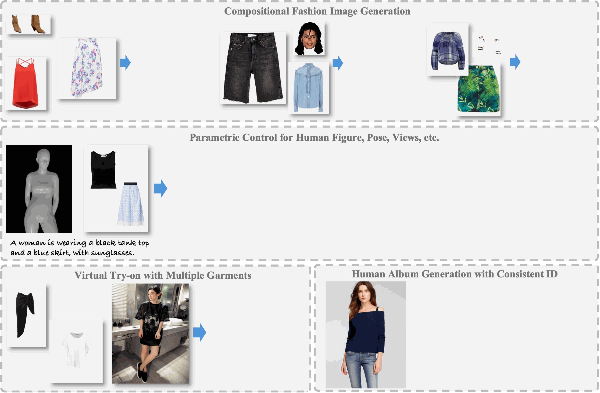

# FashionComposer
FashionComposer: Compositional Fashion Image Generation

[Sihui Ji](https://scholar.google.com/citations?hl=zh-CN&user=a6GxOZgAAAAJ), [Yiyang Wang](https://scholar.google.com/citations?user=nKr8TJwAAAAJ&hl=en), [Xi Chen](https://xavierchen34.github.io/), [Xiaogang Xu](https://xuxiaogang.com/), [Hao Luo](https://scholar.google.com/citations?user=7QvWnzMAAAAJ&hl=zh-CN), [Hengshuang Zhao](https://hszhao.github.io/)

<a href='https://sihuiji.github.io/FashionComposer-Page/'></a> <a href=''>



## Citation	

```
@article{ji2024FashionComposer,
    title={FashionComposer: Compositional Fashion Image Generation},
    author={Ji, Sihui and Wang, Yiyang and Chen, Xi and Xu, Xiaogang and Luo, Hao and Zhao, Hengshuang},
    journal={arXiv preprint arXiv:2412.xxxxx},
    year={2024}
}
```